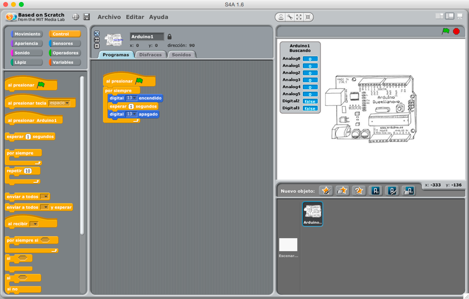
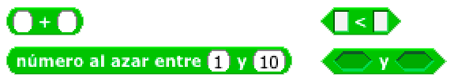
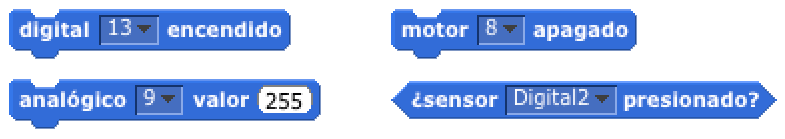
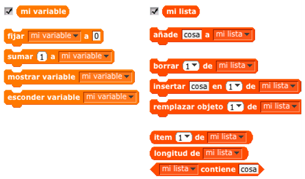

# Introducción a la programación

<br>
*Fondo Europeo de Desarrollo Regional - Una manera de hacer Europa*


***


En este apartado verás una introducción a los lenguajes de programación de placas de Arduino para utilizar en el aula con tus alumnos.

- [Scratch 4 Arduino](#scratch-4-arduino)
    - [Catálogo de instrucciones](#catálogo-de-instrucciones)
    - [Instrucciones de control](#instrucciones-de-control)
    - [Instrucciones de operación](#instrucciones-de-operación)
    - [Instrucciones de movimiento](#instrucciones-de-movimiento)
    - [Variables](#variables)
- [Arduino IDE](#arduino-ide)
    - [Sintaxis de Processing](#sintaxis-de-processing)
    - [Estructura de un programa en Arduino](#estructura-de-un-programa-en-arduino)
        - [Definición de una variable](#definición-de-una-variable)
        - [Función setup()](#función-setup())
        - [Función loop()](#función-loop())
    - [Instrucciones propias de processing](#instrucciones-propias-de-processing)
        - [Visualización de datos en pantalla](#visualización-de-datos-en-pantalla)
        - [Pausas y retardos](#pausas-y-retardos)
        - [Estructura condicional](#estructura-condicional)
    - [Instrucciones de control de pines](#instrucciones-de-control-de-pines)
    - [Declaración de librerías](#declaración-de-librerías)


***


## Scratch 4 Arduino

S4A es una modificación del software libre Scratch que nos permite crear programas para Arduino teniendo en cuenta que los programas serán siempre dependientes de su conexión con el PC.

Está basado en el lenguaje de programación por bloques y sus instrucciones han sido diseñadas con un lenguaje natural, eliminando términos técnicos y empleando una terminología más natural. Así se facilita el acceso a la programación en niveles educativos básicos.




<br />


### Catálogo de instrucciones

El conjunto de instrucciones de S4A están clasificadas por colores en las siguientes categorías:
- *Movimiento*: Conjunto de instrucciones relacionadas con el control de los pines de la tarjeta de Arduino, asñi como el control del movimiento de cualquier personaje del escenario.
- *Apariencia*: Instrucciones orientadas a modificar el aspecto de los personajes de nuestra aplicación. Para el caso de arduino, es un conjunto de instrucciones que apenas se utiliza.
- *Sonido*: Conjunto de instrucciones relacionadas con la elaboración de aplicaciones musicales, emitiendo sonidos y notas musicales.
- *Lápiz*: Scratch nos ofrece la posibilidad de que los personajes dejen un rastro durante sus movimientos por el escenario como si arrastrase un lápiz durante su trayectoria. Este rastro se genera con las instrucciones que podemos encontrar en esta sección.
- *Control*: Las instrucciones incluídas en esta sección son impresindibles para crear la lógica de nuestros programas. Incluyen condicionales, bucles y llamadas de acción.
- *Sensores*: Instrucciones de iteración con el ratón, el teclado, sonidos y los personajes.
- *Operadores*: operaciones matemáticas, lógicas y con cadenas de texto.
- *Variables*: Instrucciones para el almacenamiento y gestión de datos.


<br />

    
### Instrucciones de control

Todo programa en Scratch comienza con un clic de ratón sobre el icono de la bandera y se paraliza pulsando sobre el icono hexagonal rojo.

La instrucción `al presionar bandera verde` será la primera que incluyamos en nuestro proyecto. El resto de instrucciones se irán agregando bajo esta. Si nos fijamos en la parte inferior de los bloques encontraremos una pequeña pestaña. Cuando acercamos otra instrucción hacia la pestaña aparece una línea blanca que nos indica que la instrucción se va a añadir cuando soltemos el bloque.

Las instrucciones de tipo bucle son aquellas que suponen la repetición deuna sentencia de instrucciones. Pueden ser bucles de tipo infinito o finito, los cuales se ejecutan una determinada cantidad de veces.

Por otro lado, las instrucciones de tipo condicional ejecutan una condición y actúan según el caso de aserto.


<br />


### Instrucciones de operación

En el conjunto de instrucciones de operaciones encontraremos instrucciones para realizar operaciones matemáticas y comparaciones de tipo lógico para su usio con condiciones.

Las istrucciones redondeadas son de tipo matemático, y las de tipo rombo se utilizan para generar condiciones en bucles y condiciones.




<br >


### Instrucciones de movimiento

En el conjunto de instrucciones de movimientos observamos tanto instrucciones utilizadas en Scratch para el escenario, como instrucciones que interactúan con Arduino.

En S4A se ha eliminado el concepto de pines y estados (alto y bajo) y se utiliza un lenguaje más natural para acceder a cada una de las características de la tarjeta Arduino. Podemos utilizar los pines digitales y pines digitales PWM(~ ) mediante las instrucciones digitales, analógicas y motor.




<br >


### Variables

En el conjunto de instrucciones que proporciona S4a para variables encontramos *variables* y *listas*.

Una **variable** es un espacio donde guardar un valor. Podríamos definirla como una caja a la que ponemos un nombre y guardamos el valor. Cuando queremos acceder al valor, le llamamos por el nombre asignado a la variable.

Una **lista** es una colecciones de variables. Podríamos definirla como una lista contigua de cajas, donde caja caja están numeradas desde la posición de la caja 1 hasta la última. De esta forma, podemos acceder directamente a la posición 3 de la lista para obtener el valor de esa posición.




<br /><br />


***


## Arduino IDE

Arduino IDE es un entorno basado en Processing que nos permite programar tarjetas Arduino. Incluye instrucciones y librerías propias que facilita el proceso de programación.

Al ser un lenguaje de programación basado en código (sin entorno visual), tenemos que aprender bien la semántica del lenguaje para minimizar los errores por fallos de escritura. Igualmente debemos tener claros cuales son los errores de sintaxis más comunes para solventar los problemas con celeridad.


<br />


### Sintaxis de Processing

Es importante tener claros las siguientes reglas del lenguaje de programación:
- Las instrucciones y los nombres de las variables son **sensibles** a mayúsculas y minúsculas, es decir, debemos respetar el nombre exacto o por el contrario nos aparecerá un error.
- Toda línea termina en un **; (punto y coma)** excepto las estructuras de control que se acompañan con unas {} (llaves).
- Los espacios o saltos de linea son insignificantes, pero se aconseja tabular las instrucciones dentro de las funciones para una mejor visibilidad y lectura.
- Podemos utilizar **comentarios de texto** para documentar nuestro código fuente. Estos comentarios irán acompañados por // (doble barra diagonal).

Para familiarizarnos con la sintaxis vamos a realizar un repaso por las instrucciones más habituales con sencillos ejemplos.


<br />


### Estructura de un programa en Arduino

Todo programa para Arduino realizado en Processing, consta de la siguiente estructura:

```
//Decclaración de variables 
Variable 1
Variable 2
...
Variable N

//La función setup() es la primera función en ejecutarse, una sola vez
void setup (){
    Instrucción 1
    Instrucción 2
    ...
    Instrucción N
}

// La función loop() se ejecuta repetidamente en bucle infinito
void loop (){
    Instrucción 1
    Instrucción 2
    ...
    Instrucción N
}
```


#### Definición de variables

En la realización de nuestros programas puede ser de utilidad el uso de *variables*, por ejemplo, para almacenar datos proporcionados por sensores.

Una variable es una zona de memoria donde vamos a guardar un valor. A esta variable le asignaremos un nombre para poder acceder al valor encualquier parte de nuestro código. Los tipos de datos que vamos a utilizar en esta introducción a la programación son los siguientes:

```
int numero_entero = 13;

float numero_decimal = 3.141516;

boolean numero_bool = true;

String cadena = “¡Hola Mundo!”
```

NOTA: Para más información sobre tipos de datos primitivos en Arduino, visita el siguiente [link](http://playground.arduino.cc/ArduinoNotebookTraduccion/Datatypes).


#### Función setup()

La función *setup()* es la primera función que se ejecuta en nuestro programa, ejecutándose sólo una vez, y se utiliza para *configurar la comunicación* con nuestro equipo, *inicializar los pines* de nuestra tarjeta de Arduino e *inicialización de las variables*.

```
void setup (){
    Serial.begin(9600);
    pinMode(13, OUTPUT);
    mi_variable = 18;
}
```


#### Función loop()

La función *loop()* se ejecuta repetidamente después de la función setup(). Dentro de la misma vamos a introducir el programa que queremos ejecutar dentro de la placa de Arduino. 

```
void loop (){
    Serial.println("¡Hola mundo!");
    digitalWrite(13, HIGH);
    delay(1000);
}
```


<br />


### Instrucciones propias de processing

A continuación se detallan algunas instrucciones de processing que serán de utilidad en la elaboración de nuestros programas.


#### Visualización de datos en pantalla

La visualización de datos de pantalla resulta de gran utilidad para localizar posibles errores en la lógica de nuestros programas. Esta comprobación se realiza a través del monitor serial.

El monitor serial es una pequeña utilidad integrada dentro de Arduino IDE que nos permite enviar y recibir fácilmente información a través del puerto serie para comunicarnos con nuestar tarjeta de Arduino en tiempo real.

Para ello tenemos que configurar la velocidad de transferencia en el puerto serie a 9600 baudios y a continuación mostrar los datos por pantalla mediante la función println().

```
void setup(){
    // Conexión con el puerto serie a 9600 bps
    Serial.begin(9600);
}
 
void loop(){
    // Se imprime el texto con retorno de carro
    Serial.println("¡Hola Mundao!");
}
```

Para ver los datos que es están enviando a través de la función println() tenemos que abrir el monitor serial `Herramientas > monitor serial`.


#### Pausas y retardos

En ocasiones necesitamos establecer pausas en nuestros programas durante una determinada cantidad de tiempo.

```
//Tiempo en milisegundos
delay(1000);

//Tiempo en microsegundos
delayMicroseconds(1);
```


#### Estructura condicional

Una sentencia condicional ejecuta una o un conjunto de instrucciones en función de la condición indicada.

```
if(condición){
    // Si la condición es verdadera
    Instrucción 1
    Instrucción 2
    ...
    Instrucción N
}else{
    // En caso contrario
    Instrucción 1
    Instrucción 2
    ...
    Instrucción N
}
```

Podemos expresar condiciones anidadas como muestra el siguiente ejemplo:

```
if (número es mayor que 10){
    // El número es mayor que 10
}elseif(número es menor que 10){
    // El número es menor que 10
}else{
    // El número es igual a 10
}
```

Es una mala práctica representar muchas anidaciones de condiciones, en ese caso se utilizan otro tipo de estructuras de control más avanzadas como los switch().


<br />


### Instrucciones de control de pines

La programación de una tarjeta Arduino consiste principalmente en interactuar con los operadores conectados a cada uno de sus pines, pudiendo activar o desactivar estos pines así como datos que nos proporcionen sensores conectados a la placa.

Para realizar este tipo de acciones disponemos de las siguientes instrucciones de escritura:

```
// Establecemos el pin digital 13 a un valor alto
digitalWrite(13, HIGH);

// Establecemos el pin digital 13 a un valor bajo
digitalWrite(13, LOW);

// Establecemos el pin PWM(~) 9 a un valor entre 0 y 255
digitalWrite(13, 125);
```

Por otro lado también podemos leer datos, como datos procedentes de sensores. Para ello disponemos de las siguientes instrucciones:

```
// Establecemos en la variable dato el valor del pin digital 13
dato = digitalRead(13)

// Establecemos en la variable dato el valor del pin analógico 0
dato = analogRead(0)
```


<br />


### Declaración de librerías

Algunos operadores contienen librerías de instrucciones específicas que facilitan su programación como es el caso de servomotores, sensores de ultrasonido, display LCD, etc.

Para incluir una de esas librerías introducimos una línea al principio del archivo de nuestro programa (sería la primera línea del archivo) com ola siguiente:

```
#include <libreria.h>
```

En este caso la palabra librería será sustituído por el nombre de la librería en cuestión a utilizar. Una vez incluída podemos utilizar todas las funciones que proporciona la misma.


<br /><br />


***


#### Licencia

 Esta obra se distribuye bajo licencia [Reconocimiento-CompartirIgual 4.0 Internacional (CC BY-SA 4.0)](https://creativecommons.org/licenses/by-sa/4.0/deed.es_ES).
